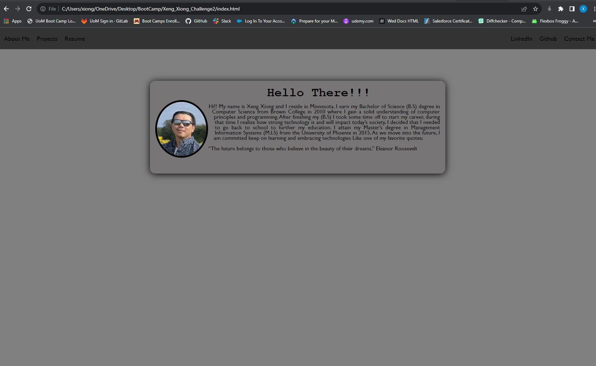

Week 2 Challenge Portfilo.

Welcome to my portfolio. This repository will show case my skills, experince and projects that I have done.

Profolio Structure: 

This repository is organized as follows:

About me: a short description of who I am.

My Work: Projects that I have been involed with.

Resume: Link to my current resume.

LinkIn: to connect with me LinkIn.

Github: link to connect with me on Github.

Contact Me: Provided is my contact information, and also a contact form for anyone that wants to send me a email with question.

Screen shot of Project:

Reference:
Shechter, E. (2022, February 27). An Interview With Elad Shechter on “The New CSS Reset. *CSS-TRICKS. Retrieved September 15, 2023, from https://css-tricks.com/an-interview-with-elad-shechter-on-the-new-css-reset/#top-of-site

Refsnes Data, (n.d). How TO - Right Aligned Menu Buttons, Retrieved September 9, 2023, from https://www.w3schools.com/howto/howto_css_topnav_right.asp

S. Image Coming Soon [Photograph]. https://www.freepik.com/search?format=search&query=image%20coming%20soon

